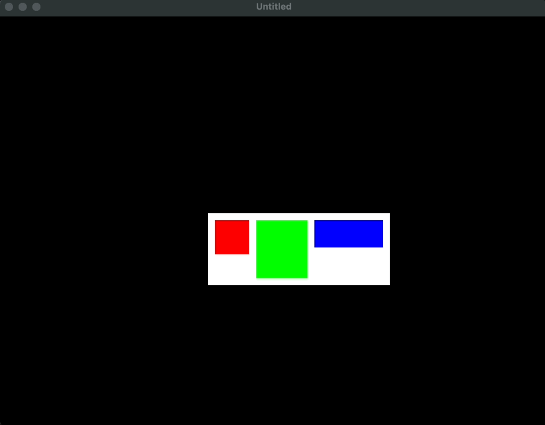
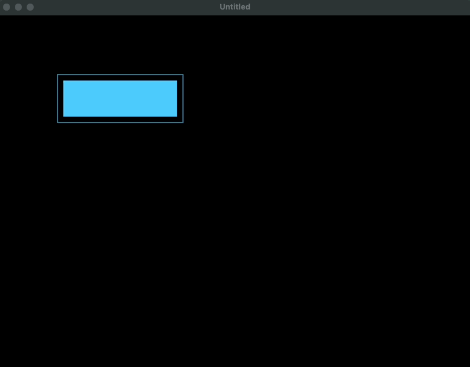

# khao

> [!WARNING]
> hey! khao is a work in progress (and so is this readme)

**khao** (thai for "rice") is a declarative ui library for löve inspired by [clay](https://github.com/nicbarker/clay) and HTML. it's designed to handle all of the math behind complex layouts and leaving the graphical work for the user.

## installation
place `khao.lua` in your project and `require` it in each file you need it.

```lua
-- relative to main.lua
local khao = require("path.to.khao")
```

## basic usage
`Element`s act as the building blocks of khao. to construct one, use the `:from` method and supply a configuration table where its __keys are properties__ and its __indices are child elements__.

```lua
local Element = khao.Element

local ui = Element:from({
    width_sizing = "fit",
    height_sizing = "fit",
    padding = 5,

    { 
        width = 100, 
        height = 100,
        color = {1,0,0,1} -- red
    },
    { 
        width = 100, 
        height = 100,
        color = {0,0,1,1} -- blue
    },
})
```
from here, we can call the methods `:calculate_dimensions` and `:calculate_positions`. _these need to be called at least once in this order_.

```lua
ui:calculate_dimensions() -- computes each element's widths and heights
ui:calculate_positions() -- computes the relative x and y of each element
```
and now we can call our element's `:draw` method and place it whereever we like, only needing to worry about the sizing of our elements.
```lua
local cursor_x, cursor_y = 0, 0

function love.mousemoved (x, y)
    cursor_x = x
    cursor_y = y
end

function love.draw ()
    ui:draw(cursor_x, cursor_y)
end
```


## a bit more in-depth
elements can also be constructed with a function call. if we abuse lua's omission of parenthesis for table literals, we can get a much cleaner mark-up.
```lua
local ui = Element { 
    gap = 10, 
    color = {0,0,0,0},

    Element { width = 150, height = 50 }
    Element { width = 150, height = 50 }
    Element { width = 150, height = 50 }
    Element { width = 150, height = 50 }
}
```

when constructing an element, the table you pass can have the following fields:
* `width_sizing` and `height_sizing` - these determine how the element should size on each axis. 
  - `"fixed"` is their default setting which sets the computed width and height to whatever you passed in.
  - `"fit"` sizing will fit its child elements and leave no empty space.
  - `"grow"` sizing will stretch itself to fit in its parent element.
* `width` and `height` - the side lengths of the element in pixels. 
  - these values are disregarded if their respective sizing is `"fit"`. 
  - when their respective sizing is `"grow"`, their values become growth factors.
* `min_width` and `min_height` - (optional) the minimum amount of pixels the side lengths can be.
* `max_width` and `max_height` - (optional) the maximum amount of pixels the side lengths can be.
* `direction` - can be `"row"` or `"column"`, determines whether elements should flow in a row or in a column.
  - is `"row"` by default.
* `align_x` - can be `"left"`, `"center"`, or `"right"`. dictates where the child elements are aligned.
  - is `"left"` by default.
* `align_y` - can be `"top"`, `"center"`, or `"bottom"`. dictates where the child elements are aligned. 
  - is `"top"` by default.
* `padding_left`, `padding_right`, `padding_top`, `padding_bottom` - each define the amount of padding in pixels each side of the element should have. 
  - when defining an element, you can set just `padding` as a shorthand to set all of them with the same value.
* `gap` - determines how many pixels of space are put between child elements.
* `name` - just a string. only used for drawing/debugging.
* `color` - a table intended for `love.graphics.setColor`. only used for drawing.
* `on_update` and `on_draw` - callbacks that are fired when `:update` and `:draw` are called, respectively. these are both executed in depth-first pre-order.
* `post_draw` - this is called depth-first *post*-order and is mainly used if you need to do any clean-up after your element is done drawing its children.

any keys passed in that aren't apart of the list above will be safely ignored.

it's important to note that the table passed used for construction is ***converted*** into an element.
```lua
local config = { width = 50, height = 50 }
local ui = Element:from(config)

config:calculate_dimensions() -- doesn't error

print(config == ui) -- true
```
after an element has been constructed, it and its children gets the following fields:
- `x` - the x position *relative* to its parent.
- `y` - the y position *relative* to its parent.
- `w` - the computed width.
- `h` - the computed height.
- `parent` - the element's parent element, can be nil.

```lua
local t = 0

local ui = Element {
    width_sizing = "fit",
    height_sizing = "fit",
    padding = 10,

    on_draw = function(self, x, y)
        local r = math.sin(t) / 2 + 0.5
        local g = math.sin(t + math.pi * (1/3)) / 2 + 0.5
        local b = math.sin(t + math.pi * (2/3)) / 2 + 0.5
        love.graphics.setColor(r, g, b)
        love.graphics.rectangle("line", x, y, self.w, self.h)
    end,
    post_draw = function(self, x, y)
        love.graphics.setColor(1, 1, 1)
    end,

    Element {
        on_update = function(self, dt)
            self.width = (math.cos(t) + 1) * 100
            self.height = (math.sin(t) + 1) * 100
        end,
        on_draw = function(self, x, y)
            love.graphics.rectangle("fill", x, y, self.w, self.h)
        end
    }
}

ui:calculate_dimensions()
ui:calculate_positions()

function love.update (dt)  
    t = t + dt

    ui:update(dt)

    -- whenever you change the sizing of an element, you should call these to recalculate sizes and positions.
    ui:calculate_dimensions() 
    ui:calculate_positions()
end

function love.draw ()
    ui:draw(100, 100)

    love.graphics.print("t: " .. t, 50, 50)
end
```

